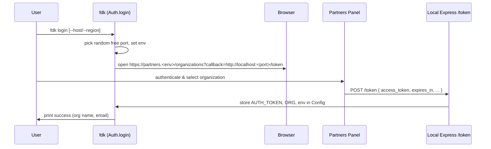

### FDK CLI – Internal Architecture & Developer Guide

This document explains **how the FDK CLI works internally**: its architecture, command flows, important modules, and how to run and debug it from source.

It is meant to complement the main `README.md` (which is user‑facing) with a **developer‑oriented overview**.

---

### 1. High‑level architecture

- **CLI entrypoint**
  - `bin/fdk.js` is the binary exposed as `fdk`.
  - It:
    - Verifies Node.js version \(\>= 18\).
    - Requires `dist/fdk` (compiled from `src/fdk.ts`).
    - Calls `init('fdk')` and then `parseCommands()`.

- **Core CLI wiring**
  - `src/fdk.ts`:
    - Creates a `commander` program instance.
    - Extends `Command.prototype` with `.asyncAction(fn)` to wrap every command in common setup/teardown:
      - Logging and debug mode.
      - SSL / CA‑file configuration.
      - Environment and authentication guards.
      - Theme directory/context validation.
      - Centralized error handling (mapped to `CommandError`, Sentry, etc.).
    - Registers all top‑level command groups via `registerCommands(program)` from `src/commands/index.ts`.
    - Performs a background **version check** and prints an upgrade hint when a newer CLI version is published.

- **Command groups**
  - Implemented under `src/commands/` and wired to domain logic in `src/lib/`:
    - `auth` – login/logout/user.
    - `populate` – seed dev account with sample data.
    - `tunnel` – Cloudflare tunnel wrapper.
    - `theme` – theme lifecycle (new, init, serve, sync, pull, package, context).
    - `extension` – extension lifecycle (init, preview‑url, launch‑url, pull‑env).
    - `binding` – extension section bindings (init, draft, publish, preview, context).
    - `config` – CLI‑level config (CA file, strict SSL).

- **Domain & utilities**
  - `src/lib/` provides:
    - Cross‑cutting utilities: `Logger`, `Debug`, `CommandError`, `Config`, `Env`.
    - Feature modules:
      - `Auth` – OAuth‑style login using a local Express callback server.
      - `Theme` / `ThemeContext` – theme workflows and context management.
      - `Extension`, `ExtensionPreviewURL`, `ExtensionLaunchURL`, `ExtensionEnv`, `ExtensionSection`.
      - `Tunnel` – Cloudflare tunnel orchestration.
    - HTTP client and service layer:
      - `api/ApiClient` – Axios instance with retries, curl‑style debug logs, and error mapping.
      - `api/services/*.service.ts` – thin wrappers per backend domain (auth, theme, extension, locales, configuration, company setup, uploads, etc.).
  - `src/helper/` provides:
    - FS and process helpers (`utils.ts`, `file.utils.ts`, `archive.ts`, `clone_git_repository.ts`, `download.ts`).
    - Dev‑server helpers (`serve.utils.ts`, `build.ts`, webpack configs).
    - Extension helpers (`extension_utils.ts`, constants/templates, spinner/formatter/curl helpers).

- **Templates & samples**
  - Theme templates: `template/` (Vue) and `react-template/` (React).
  - Extension section templates: `extension-section/`, `extension-section-vue/`.
  - Sample upload script: `sample-upload.js` + `sample-upload.jpeg`.

---

### 2. Configuration, environment & auth

- **Where configuration lives**
  - Centralized in `Config` (backed by `configstore`).
  - Important keys:
    - **Environment**
      - `CURRENT_ENV_VALUE` – API host (e.g. `api.fynd.com`).
    - **Authentication & org**
      - `AUTH_TOKEN` – access token, expiry, current user.
      - `ORGANIZATION` / `ORGANIZATION_DETAIL`.
      - `COMPANY_ID`, `PARTNER_ACCESS_TOKEN`, `API_VERSION`.
    - **SSL extras**
      - `EXTRAS` object containing:
        - `CA_FILE` – custom CA path.
        - `STRICT_SSL` – toggle strict TLS verification.

- **Environment handling**
  - `Env.verifyAndSanitizeEnvValue(host)`:
    - Normalizes `partners.*` → `api.*`.
    - Validates basic structure and reachability via a health endpoint.
  - `Env.setEnv` / `Env.setNewEnvs`:
    - Persist sanitized env in `Config`.
    - Used during login to switch regions/hosts.

- **Authentication flow (simplified)**



- **Global guards in `asyncAction`**
  - **Env guard**: except for pure env commands (currently unused), all commands need `CURRENT_ENV_VALUE`.
  - **Auth guard**: all commands except `auth`/`login`/`logout`/auth‑related extension commands require a valid, non‑expired `AUTH_TOKEN`.
  - **Theme context/env guard**:
    - Theme commands validate:
      - An active theme context exists.
      - Context env matches current env.
  - **Theme directory guard**:
    - If a command is theme‑related and the current directory is not recognized as a theme, the CLI offers to initialize `.fdk` or aborts.

---

### 3. Command flows (with diagrams and examples)

#### 3.1 Global lifecycle – how any command runs

```mermaid
flowchart TD
    A[User runs 'fdk ...'] --> B[bin/fdk.js]
    B --> C[dist/fdk.init('fdk')]
    C --> D[registerCommands(program)]
    D --> E[program.parse(process.argv)]
    E --> F[Matched Command.asyncAction(handler)]
    F --> G[Setup: logger, SSL, env, auth, theme context]
    G --> H[Run handler(...args)]
    H --> I[Handler uses lib/*, ApiClient, services]
    I --> J[On success: log & exit 0]
    I --> K[On error: map to CommandError / Sentry / debug.log]
```

**Key behavior:**

- All command handlers are **pure async functions** that assume:
  - Env and auth are valid.
  - For theme commands, that the project directory and context are valid.
- They delegate actual work to domain modules (`Theme`, `Extension`, etc.), which in turn use service clients and helpers.

---

#### 3.2 Theme flows

##### 3.2.1 Create a new theme

**Command:**

```sh
fdk theme new -n my-theme -t react   # or vue2
```

**High‑level flow:**

```mermaid
flowchart TD
    A[fdk theme new] --> B[asyncAction: env/auth/context checks]
    B --> C[Theme.createTheme]
    C --> D[Ensure empty/non-theme directory]
    D --> E[Create .fdk structure]
    E --> F[Copy React/Vue template from repo]
    F --> G[Install npm dependencies]
    G --> H[Call ThemeService & ConfigurationService<br/>to create/register theme]
    H --> I[Create theme context (.fdk/context.json)]
    I --> J[Log next steps (serve/sync/pull)]
```

##### 3.2.2 Initialize an existing theme locally

**Command:**

```sh
mkdir my-live-theme
cd my-live-theme
fdk theme init
```

**Flow (simplified):**

1. Prompt to select company, app and theme from your account.
2. Download theme bundle and unpack into current directory.
3. Set up `.fdk` folder and theme context for this app/theme/env.
4. Next steps for you: `fdk theme serve` and `fdk theme sync`.

##### 3.2.3 Local theme development

**Commands:**

```sh
# Start dev server with SSR & HMR
fdk theme serve --ssr true --hmr true --port 5001

# Sync local bundle with remote
fdk theme sync
```

**Serve flow (simplified):**

```mermaid
flowchart TD
    A[fdk theme serve] --> B[Theme.serveTheme]
    B --> C[Load active context & env]
    C --> D[Build webpack config (React/Vue)]
    D --> E[Start dev server (Express + webpack dev middleware)]
    E --> F[Setup socket.io + chokidar watchers]
    F --> G[Open preview URLs in browser]
```

**Sync flow (conceptual):**

- Read current theme context and local build output.
- Fetch remote theme definition and sections.
- Compare sections/locales, warn on mismatches.
- Upload changed assets and configuration via `ThemeService`/`UploadService`.

---

#### 3.3 Extension flows

##### 3.3.1 Initialize an extension

**Command:**

```sh
fdk extension init --template node-react --target-dir my-extension
```

**Flow:**

```mermaid
flowchart TD
    A[fdk extension init] --> B[Extension.initExtensionHandler]
    B --> C[Validate dependencies (npm)]
    C --> D[Fetch existing extensions via ExtensionService]
    D --> E{Create new or reuse existing?}
    E -->|New| F[Prompt for name, type, launch_type,<br/>payment slug if needed]
    E -->|Existing| G[Select extension, fetch details]
    F --> H[Select template repo based on template/launch_type]
    G --> H
    H --> I[Clone repo into targetDir]
    I --> J[Replace placeholders, write config files]
    J --> K[Install dependencies]
    K --> L[Register or update extension via ExtensionService]
```

##### 3.3.2 Preview an extension

**Command examples:**

```sh
cd my-extension
fdk extension preview

fdk extension preview --company-id 999
fdk extension preview --tunnel-url https://custom-url.com --port 8080
```

**Flow (core pieces):**

- Parse options and project config (`fdk.ext.*`).
- Load or reset `ExtensionContext` (env, extension key, dev company).
- Resolve extension (by API key or interactive selection).
- Determine dev ports and install dependencies if required.
- Set up tunnel:
  - Use custom tunnel URL/port if provided.
  - Otherwise start a **Cloudflare tunnel** via `Tunnel` on the frontend port.
- Start local dev servers (frontend and backend) with the configured commands.
- Update extension launch URL on partners panel (unless `--no-auto-update`).

---

#### 3.4 Extension binding flows

##### 3.4.1 Initialize binding boilerplate

```sh
fdk binding init -n hero-banner -f react -i "Web Theme"
```

**Flow:**

- Collect or prompt for:
  - Binding name, interface, framework.
  - Extension and organization context if missing.
- Create `bindings/theme/<framework>/...` directory structure.
- Copy template from `extension-section/` or `extension-section-vue/`.
- Save context into `.fdk/context.json` for subsequent draft/publish/preview commands.

##### 3.4.2 Draft / publish / preview

- **draft**:
  - Register binding drafts across development companies using theme + extension services.
- **publish**:
  - Promote drafts to live bindings across companies.
- **preview**:
  - Start a local dev server + Cloudflare tunnel.
  - Wire the preview URL into the live storefront so the binding can be tested in situ.

---

#### 3.5 Utility flows (populate, tunnel, config)

- **Populate dev account**

```sh
fdk populate
```

- Asks you to pick a development company.
- Calls company setup APIs repeatedly following `next_step` instructions until sample data is ready.
- Prints platform URL to inspect products.

- **Tunnel**

```sh
fdk tunnel --port 8080
```

- Installs `cloudflared` binary if missing.
- Starts a tunnel to `http://localhost:8080`.
- Prints the public URL and logs reconnects/retries.

- **Config**

```sh
fdk config set cafile /path/to/ca.pem
fdk config set strict-ssl false
```

- Mutates config values that the global `asyncAction` consumes to set:
  - `FDK_EXTRA_CA_CERTS` → Node extra CA.
  - `NODE_TLS_REJECT_UNAUTHORIZED` and `FDK_SSL_NO_VERIFY` when strict SSL is disabled.

---

### 4. Local development of the CLI itself

This section focuses on **working on the CLI as a developer** (not as a user of the published package).

#### 4.1 Prerequisites

- Node.js **18.x or higher**.
- npm (or any Node package manager; commands below use npm).

#### 4.2 Setup & build

```sh
git clone <this-repo-url>
cd fdk-cli
npm install

# One‑time / on‑demand build
npm run build
```

- `npm run build`:
  - Cleans `dist/`.
  - Compiles `src/**/*.ts` to `dist/**/*.js` via `tsc`.
  - Copies any `src/**/*.html` to `dist/`.

For active development, use **watch mode**:

```sh
npm run watch
```

- Recompiles to `dist/` as you edit TypeScript files.

#### 4.3 Running the CLI from source

After building:

```sh
node bin/fdk.js --help
node bin/fdk.js login
node bin/fdk.js theme
```

Because `bin/fdk.js` imports `../dist/fdk`, you must ensure `dist/` is up to date (via `build` or `watch`).

Optionally, you can install the CLI **globally from this checkout**:

```sh
npm run build
npm run localInstall   # see scripts/localInstall.sh for exact behavior

# Then, use it like the published package:
fdk --help
```

#### 4.4 Testing & formatting

- **Unit tests (Jest):**

```sh
npm test
```

- **Formatting (Prettier):**

```sh
npm run pretty
```

#### 4.5 Debugging and tracing calls

- **Verbose CLI logging:**

```sh
fdk login --verbose
fdk theme serve --verbose
```

- This:
  - Enables internal `Debug` logging.
  - Writes a `debug.log` file in the current working directory.
  - Prints curl‑style HTTP requests (via `ApiClient`) when debug is enabled.

- **Code‑level debugging tips:**
  - Put temporary `Debug('message', data)` calls in modules under `src/lib` or `src/helper` to trace flows.
  - Prefer running with `npm run watch` so edits are quickly reflected in `dist/`.
  - When tracing HTTP/API issues, pay attention to:
    - `ApiClient` interceptors (request/response).
    - `CommandError` error codes in `CommandError.ts`.

---

### 5. How to extend the CLI safely

When adding a new command or feature:

- **1. Add a command entry**
  - Create a new file under `src/commands/<feature>.ts` or update an existing group builder.
  - Register your command using `.command(...).description(...).asyncAction(handler)`.

- **2. Implement domain logic**
  - Put actual logic into `src/lib/<Feature>.ts` and keep command handlers thin.
  - Use existing helpers:
    - `Config` for reading/writing CLI configuration.
    - `Env` for env checks and URL generation.
    - `ApiClient` + `api/services/*` to talk to backend services.
    - `Logger`, `Debug`, and `CommandError` for consistent UX.

- **3. Rely on global guards**
  - `asyncAction` already ensures:
    - Env and auth presence (unless your command is explicitly whitelisted).
    - SSL and CA setup.
  - Only add extra validation if your command has special constraints.

- **4. Update tests & docs**
  - Add Jest tests under `src/__tests__/` for your new behavior.
  - Update the user‑facing `README.md` if you add public commands or flags.

This structure lets you reason about the CLI as:

- A thin **command layer** in `src/commands`.
- A reusable **domain/service layer** in `src/lib` and `src/api`.
- A shared **infrastructure layer** (logging, config, env, HTTP, dev‑server, tunnels) in `src/lib` and `src/helper`.

Once you are comfortable with these layers, you can trace or modify any flow by following:

> command → handler in `src/commands` → domain function in `src/lib` → service client in `src/api/services` → HTTP request via `ApiClient`.

