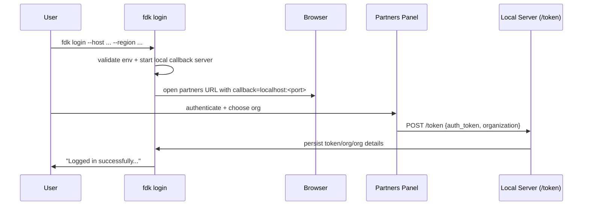
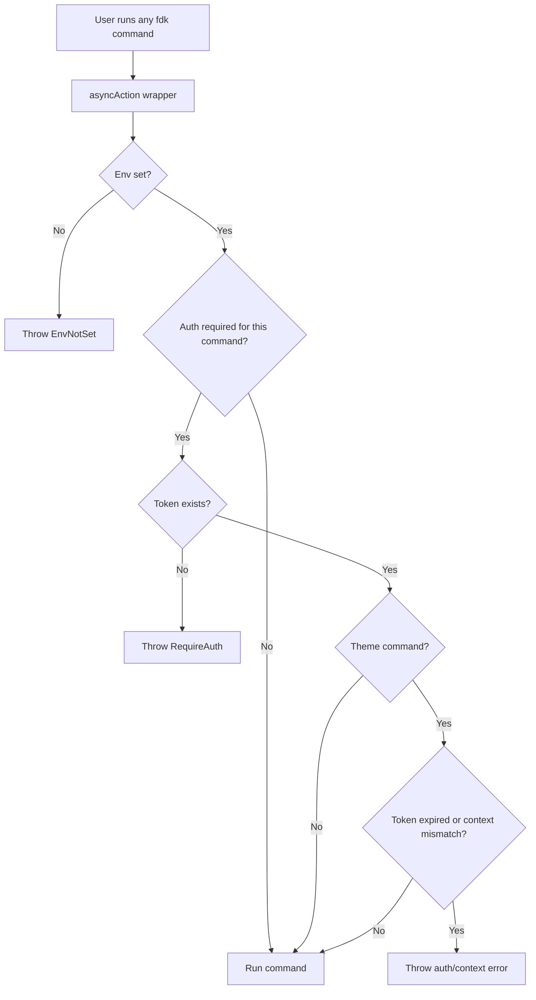
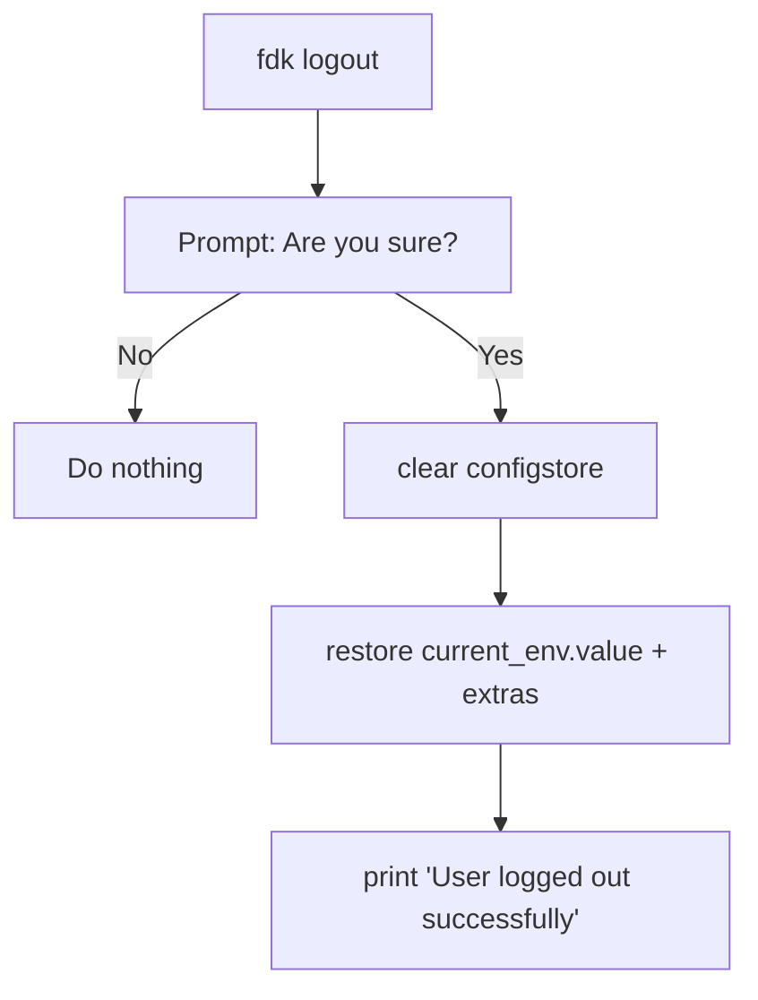
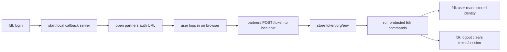
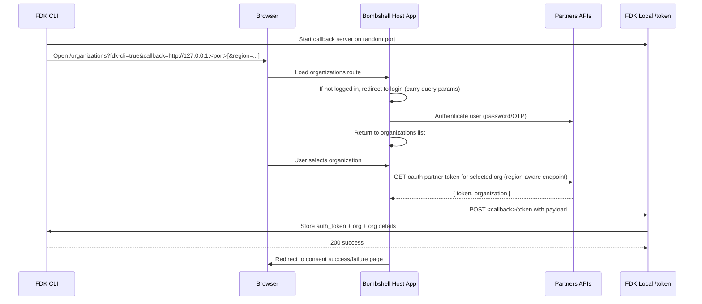
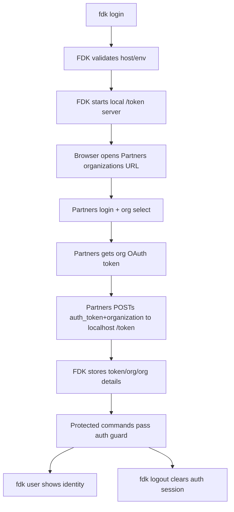

# FDK CLI Authentication & Authorization Guide

This document explains **everything auth-related** in this CLI in a simple way:

- How `login` works internally.
- How commands are authorized (who can run what).
- What `user` shows.
- What `logout` clears.
- Real command examples.
- Easy flow diagrams.

---

## 1) Quick mental model

FDK auth has 2 layers:

1. **Authentication (who you are)**
  You run `fdk login`, complete login in browser, and CLI stores token/org locally.
2. **Authorization guard (what you can run)**
  Before most commands, FDK checks if token/env is present and valid.

So practically:

- `login` creates a local authenticated session.
- `user` reads that session and prints identity info.
- `logout` removes the session.
- Other commands use this session automatically.

---

## 2) Where auth state is stored

FDK uses `configstore` (not a repo `.env` file).

Important keys in `src/lib/Config.ts`:

- `current_env.value` (`CONFIG_KEYS.CURRENT_ENV_VALUE`) -> active API domain (example: `api.fynd.com`)
- `current_env.auth_token` (`CONFIG_KEYS.AUTH_TOKEN`) -> token + user + expiry info
- `current_env.organization` -> selected organization id
- `current_env.organization_detail` -> organization metadata
- `extras.strict_ssl`, `extras.ca_file` -> TLS/CA behavior

---

## 3) Login flow in detail (`fdk login`)

Command registration (`src/commands/auth.ts`):

- `fdk auth` (alias `fdk login`)
- options:
  - `--host [platform-host]`
  - `--region [region]`

Core logic lives in `src/lib/Auth.ts`.

### 3.1 What happens step by step

1. CLI picks a random free localhost port.
2. CLI resolves target env domain:
  - if `--host` passed: validates/sanitizes host with `Env.verifyAndSanitizeEnvValue()`
  - else defaults to `api.fynd.com`
3. If env changed from current env:
  - marks new domain for post-login update
  - clears old auth session (keeps env extras like CA/SSL settings)
4. Checks if already logged in and token not expired:
  - asks: "Do you wish to change the organization?"
5. Starts a local Express server (`POST /token`) on localhost.
6. Builds partners login URL:
  - `https://partners.<domain>/organizations/?fdk-cli=true&callback=http://localhost:<port>[&region=...]`
7. Opens browser to that URL.
8. After browser login/org selection, partners posts token payload to local `POST /token`.
9. CLI callback handler stores:
  - token + computed `expiry_time`
  - organization id
  - organization details
  - updated env (if host changed)
10. CLI closes local auth server and prints success.

### 3.2 Login sequence diagram




### 3.3 Token expiry handling

- On callback, CLI computes:
  - `expiry_time = now + expires_in`
- Later checks compare current timestamp with `expiry_time`.
- If expired, commands treat user as not logged in and ask for re-login.

---

## 4) Authorization checks before command execution

Global checks run in `src/fdk.ts` inside `Command.prototype.asyncAction`.

### 4.1 What is checked

For most commands, wrapper does:

1. Logging/debug init
2. SSL/CA setup
3. **Environment check**
  - `CURRENT_ENV_VALUE` must exist (except env commands)
4. **Auth token check**
  - token must exist for protected commands
5. **Theme token-expiry + context consistency checks**
  - for theme commands, token must be non-expired
  - active theme context env must match current env

### 4.2 Command categories (important)

- Auth commands exempt from login requirement:
  - `auth`, `login`, `logout`
- Some extension commands are also exempt from strict auth check path:
  - `init`, `get`, `set`, `pull-env` (based on `EXTENSION_COMMANDS`)

If a command fails auth guard, CLI throws `RequireAuth` style `CommandError`.

### 4.3 Authorization guard diagram




---

## 5) `fdk user` flow

Command: `fdk user`

What it does:

1. Reads `AUTH_TOKEN` from config store.
2. Extracts `current_user`.
3. Finds active + primary email.
4. Prints:
  - full name
  - email
  - organization display name

Example:

```sh
fdk user
```

Typical output shape:

- Name: First Last
- Email: [your-primary-email@domain.com](mailto:your-primary-email@domain.com)
- Organization: Your Org

---

## 6) `fdk logout` flow

Command: `fdk logout`

What happens:

1. CLI asks confirmation (`Yes/No`).
2. On `Yes`, it clears config store auth session.
3. It preserves:
  - current env value
  - extras (CA file / strict SSL settings)
4. Prints success message.

So logout removes identity/session, but not your network/SSL preferences.

Diagram:




---

## 7) Host and region behavior

### `--host`

- Accepts partners or API style host.
- CLI sanitizes:
  - `partners.fynd.com` -> `api.fynd.com`
  - `partners-xyz...` -> `api-xyz...`
- Validates domain format and health endpoint reachability.

If invalid/unreachable, login fails with a clear input error.

### `--region`

- Appended as query param in partners login URL.
- Example:
  - `asia-south1`
  - `asia-south1/development`

---

## 8) Real examples you can run

### Basic login

```sh
fdk login
```

### Login to a specific host

```sh
fdk login --host partners.fynd.com
```

### Login with API host + region

```sh
fdk login --host api.fynd.com --region asia-south1
```

### Verify logged-in identity

```sh
fdk user
```

### Logout

```sh
fdk logout
```

### Debug auth flow

```sh
fdk login --verbose
```

This creates `debug.log` in current directory and gives detailed traces.

---

## 9) Common auth issues and what they mean

- **"RequireAuth" style error**  
You are not logged in (or token/session missing). Run `fdk login`.
- **Token expired behavior**  
Session exists but `expiry_time` has passed. Run `fdk login` again.
- **Callback timeout during login**  
Local auth server waits ~2 minutes; if not completed in time, run `fdk login` again.
- **Invalid host/domain**  
Provided `--host` is invalid or unreachable. Use a valid Fynd API domain.

---

## 10) End-to-end auth flow summary




If you keep this one line in mind, auth becomes easy:

> `login` writes local session, command wrapper enforces it, `user` reads it, `logout` clears it.

---

## 11) Partners (`bombshell`) side auth flow (cross-repo)

This section explains what happens in the Partners app (`bombshell`) after FDK opens the browser URL.

### 11.1 Key files on partners side

- `bombshell/packages/host/src/pages/authentication/login.vue`
  - Handles login UI and redirects to organizations page.
- `bombshell/packages/host/src/pages/organizations.vue`
  - Handles organization selection and FDK callback mode.
- `bombshell/packages/host/src/services/fdk-cli.service.js`
  - Sends token payload to FDK callback URL (`<callback>/token`).
- `bombshell/packages/host/src/services/authentication.service.js`
  - Fetches partner OAuth token for chosen organization.
- `bombshell/packages/host/src/services/domain.service.js`
  - Builds base API URL and region-aware token endpoint.
- `bombshell/packages/host/src/router/guards/index.js`
  - Contains callback allowlist checks in one guard path.
- `bombshell/packages/host/src/components/authentication/consent-grant.vue`
  - Shows success/failure after callback handoff.

### 11.2 Cross-repo sequence (FDK + Partners)




### 11.3 Payload sent by Partners to FDK

Partners posts:

```json
{
  "auth_token": "tokenInfo.data.token",
  "organization": "tokenInfo.data.organization"
}
```

Actual payload example (from test fixture in this repo):

```json
{
  "auth_token": {
    "access_token": "pr-4fb094006ed3a6d749b69875be0418b83238d078",
    "token_type": "Bearer",
    "expires_in": 7199,
    "scope": ["organization/*"],
    "current_user": {
      "id": "0f2f6aa3abbe0f86c4ef8c5c",
      "emails": [
        {
          "email": "jinalvirani@gofynd.com",
          "primary": true,
          "verified": true,
          "active": true
        }
      ],
      "first_name": "Jinal",
      "last_name": "Virani",
      "phone_numbers": [
        {
          "verified": true,
          "country_code": 91,
          "primary": true,
          "phone": "7405028057",
          "active": true
        }
      ],
      "profile_pic_url": "https://cdn.pixelbin.io/v2/falling-surf-7c8bb8/fyndnp/wrkr/addsale/misc/default-assets/original/default-platform-profile.png"
    },
    "redirect_urls": ["https://localhost"]
  },
  "organization": "60afe92972b7a964de57a1d4"
}
```

FDK expects exactly this shape and then computes/stores:

- `auth_token.expiry_time = now + auth_token.expires_in`
- `organization`
- `organization_detail` (fetched separately by FDK)

### 11.4 Endpoint chain in Partners

- Login/session side:
  - `/v1.0/auth/login/password`
  - OTP routes (`send/verify/resend`)
  - `/v1.0/profile`
- Organization side:
  - `/v1.0/organization`
  - `/v1.0/organization/:id`
- Token handoff side:
  - `/v1.0/organization/:id/oauth/partner/token`
  - region variant: `/region/:region/.../v1.0/organization/:id/oauth/partner/token`
- Callback to local FDK:
  - `POST <callback>/token`

### 11.5 Important caveats found (current implementation)

1. **Region propagation risk**
  - FDK includes `region` in initial URL.
  - In one login redirect path, `fdk-cli` and `callback` are forwarded but `region` may not always be preserved.
  - Effect: token fetch can fall back to non-region path after fresh login.
2. **Callback validation inconsistency**
  - One router-guard path validates callback domain strictly (allowlist style).
  - Main organizations callback path posts to `query.callback` without the same validation layer.
3. **Callback URL assumptions**
  - Current FDK uses `http://127.0.0.1:<port>` and matches expected local callback behavior.
  - Alternate localhost formats may behave differently depending on which partners path is hit.
4. **Callback POST timeout behavior**
  - Partners callback POST client path does not enforce a strong explicit timeout in this flow.
  - FDK side waits ~2 minutes for callback server timeout.

---

## 12) Complete auth picture in one glance




